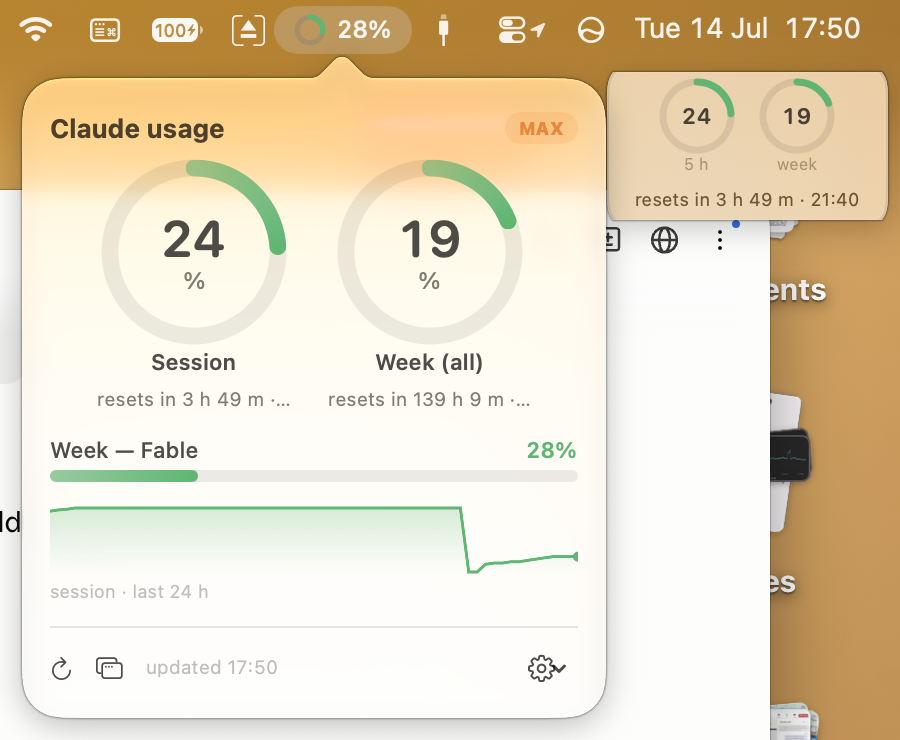

# Claude Meter

A tiny menu bar (macOS) / system tray (Windows) app that shows your **Claude
plan usage** at a glance — the same numbers as the Claude app's
*Settings → Usage* screen, without having to go looking for them.



## Features

- **Menu bar / tray**: a traffic-light ring (green → amber → red) for whichever
  limit is closest to its ceiling (configurable). On macOS the percentage sits
  next to the icon; on Windows it's drawn inside the ring.
- **Popover / flyout** (click the icon): animated ring gauges for the 5-hour
  session window and the weekly limit, per-model weekly bars, reset countdowns,
  your plan badge, and a 24-hour usage sparkline.
- **Floating desktop gauge**: a small always-on-top panel with mini gauges and
  the reset countdown. Drag it anywhere; position is remembered. Two layouts:
  one-line or square.
- **Usage warnings**: a notification when any limit crosses a threshold
  (80/90/95%, or off). Warns once per approach, re-arms after the reset.
- **Configurable** from the gear menu: desktop gauge on/off and layout, which
  limit the icon tracks, percent display on/off, warning threshold, launch
  at login.

Works with any Claude subscription (Pro, Max, …) — it displays whatever
limits your plan reports. Dates and times follow your system locale.

## Requirements

Both platforms need [Claude Code](https://claude.com/claude-code) installed
and signed in at least once **on the same machine** (that's where the
credentials come from).

- **macOS**: macOS 14 or later; Xcode Command Line Tools to build
  (`xcode-select --install`).
- **Windows**: Windows 10 or later; the [.NET 8 SDK](https://dotnet.microsoft.com/download/dotnet/8.0)
  to build (`winget install Microsoft.DotNet.SDK.8`).

## Install

### macOS

```sh
git clone https://github.com/bernmc/claude-meter.git
cd claude-meter/macos
./build.sh --install
```

That compiles a universal binary, ad-hoc signs it, installs to
`~/Applications/Claude Meter.app`, and launches it. No Xcode project, no
dependencies — one Swift file.

### Windows

```powershell
git clone https://github.com/bernmc/claude-meter.git
cd claude-meter\windows
.\build.ps1 -Install
```

That compiles and installs to `%LOCALAPPDATA%\Programs\Claude Meter`, then
launches it. No Visual Studio, no dependencies — one C# file. Add `-Portable`
to instead produce a self-contained exe that runs on machines without .NET.

To test the data path without the UI:

```sh
# macOS
"$HOME/Applications/Claude Meter.app/Contents/MacOS/Claude Meter" --once
# Windows
& "$env:LOCALAPPDATA\Programs\Claude Meter\Claude Meter.exe" --once
```

## How it works (and what it touches)

You should know exactly what an app near your credentials does:

- It reads Claude Code's OAuth credentials from where Claude Code keeps them —
  the **login keychain** on macOS (service `Claude Code-credentials`, via
  `/usr/bin/security`), the file `%USERPROFILE%\.claude\.credentials.json` on
  Windows. Nothing is sent anywhere except to Anthropic's own endpoints.
- Every 60 s it calls `GET https://api.anthropic.com/api/oauth/usage` — the
  endpoint the Claude app's usage screen uses — with your token.
- When the access token expires it refreshes it via
  `POST https://platform.claude.com/v1/oauth/token` (Claude Code's public
  OAuth client id) and **writes the rotated tokens back** so Claude Code stays
  signed in. This mirrors what Claude Code does itself.
- Usage history for the sparkline is stored locally (7-day retention) in
  `~/Library/Application Support/Claude Meter/` (macOS) or
  `%APPDATA%\Claude Meter\` (Windows, alongside `settings.json`).

No analytics, no third-party services, no network calls other than the two
Anthropic endpoints above.

> **Note:** sign in to Claude Code separately on each machine you run
> Claude Meter on. Don't copy the credentials file between machines — refresh
> tokens rotate on use, and two copies of the same token family will sign
> each other out.

## Disclaimer

This is an **unofficial** tool, not affiliated with or endorsed by Anthropic.
It uses undocumented endpoints that Anthropic may change or remove at any
time, which would break the app without notice. Use at your own risk.

## Uninstall

**macOS** — quit the app, then:

```sh
rm -rf ~/Applications/"Claude Meter.app" ~/Library/Application\ Support/"Claude Meter"
defaults delete au.bernard.claude-meter
```

**Windows** — quit the app (tray icon → Quit), then:

```powershell
Remove-Item -Recurse -Force "$env:LOCALAPPDATA\Programs\Claude Meter", "$env:APPDATA\Claude Meter"
Remove-ItemProperty -Path HKCU:\Software\Microsoft\Windows\CurrentVersion\Run -Name "Claude Meter" -ErrorAction SilentlyContinue
```

Your Claude Code credentials are left untouched.

## License

[MIT](LICENSE)
