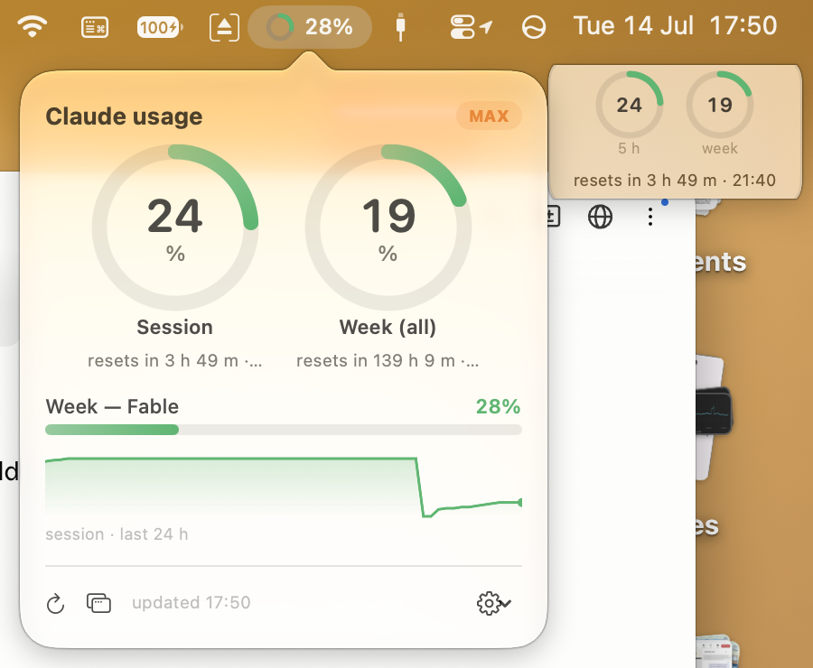
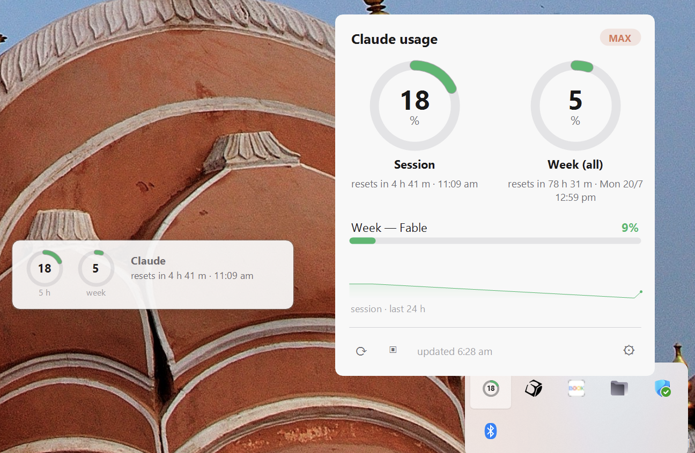

# Claude Meter

A tiny menu bar (macOS) / system tray (Windows) app that shows your **Claude
plan usage** at a glance — the same numbers as the Claude app's
*Settings → Usage* screen, without having to go looking for them.





## Features

- **Menu bar / tray**: a traffic-light ring (green → amber → red) for whichever
  limit is closest to its ceiling (configurable). On macOS the percentage sits
  next to the icon; on Windows it's drawn inside the ring.
- **Popover / flyout** (click the icon): three animated ring gauges (the 5-hour
  session window, the weekly limit, and the per-model weekly limit), any further
  per-model weekly bars, reset countdowns, your plan badge, and a 24-hour usage
  sparkline.
- **Floating desktop gauge**: a small always-on-top panel with three mini gauges and
  the reset countdown. Drag it anywhere; position is remembered. Three layouts:
  one-line, square, or Apple-Watch-style concentric rings (week outside, model,
  session inside) with the percentages stacked in the centre. Pick the layout from
  the gear menu or the right-click menu; "Rings centre" chooses whether the week or
  the session number is largest.
- **Usage warnings**: a notification when any limit crosses a threshold
  (80/90/95%, or off). Warns once per approach, re-arms after the reset.
- **Configurable** from the gear menu: desktop gauge on/off and layout, which
  limit the icon tracks (worst limit, session, week, or model week), percent display on/off, warning threshold, update check, launch
  at login. Choose which limits are drawn as gauges (Gauges in the gear menu).

Works with any Claude subscription (Pro, Max, …) — it displays whatever
limits your plan reports. Dates and times follow your system locale.

## Requirements

Both platforms need [Claude Code](https://claude.com/claude-code) installed
and signed in at least once **on the same machine** (that's where the
credentials come from).

- **macOS**: macOS 14 or later; Xcode Command Line Tools to build
  (`xcode-select --install`).
- **Windows**: Windows 10 or later. To build you need the
  [.NET 8 SDK](https://dotnet.microsoft.com/download/dotnet/8.0)
  (`winget install Microsoft.DotNet.SDK.8`); to *run*, the standard build
  needs the .NET 8 Desktop Runtime, while a `-Portable` build (or a
  [Releases](https://github.com/bernmc/claude-meter/releases) exe) is fully
  self-contained and needs nothing installed.

## Install

### macOS

```sh
git clone https://github.com/bernmc/claude-meter.git
cd claude-meter/macos
./build.sh --install
```

That compiles a universal binary, ad-hoc signs it, installs to
`~/Applications/Claude Meter.app`, and launches it. No Xcode project, no
dependencies — one Swift file.

### Windows

```powershell
git clone https://github.com/bernmc/claude-meter.git
cd claude-meter\windows
.\build.ps1 -Install
```

That compiles and installs to `%LOCALAPPDATA%\Programs\Claude Meter`, then
launches it. No Visual Studio, no dependencies — one C# file. Add `-Portable`
to instead produce a self-contained exe that runs on machines without .NET
(it targets your machine's architecture; override with `-Arch x64`/`-Arch arm64`).

Prefer not to build at all? Grab the standalone exe for your architecture
from [Releases](https://github.com/bernmc/claude-meter/releases). The exes
are unsigned, so SmartScreen will warn on first run — "More info → Run anyway".

To test the data path without the UI:

```sh
# macOS
"$HOME/Applications/Claude Meter.app/Contents/MacOS/Claude Meter" --once
# Windows
& "$env:LOCALAPPDATA\Programs\Claude Meter\Claude Meter.exe" --once
```

#### Sign-in expired?

If the meter shows "Claude Code sign-in has expired or been revoked", click
**Sign in to Claude Code…** in the tray menu or the flyout. If Claude Code isn't
installed, it shows the `winget install Anthropic.ClaudeCode` command to run first.

## How it works (and what it touches)

You should know exactly what an app near your credentials does:

- It reads Claude Code's OAuth credentials from where Claude Code keeps them —
  the **login keychain** on macOS (service `Claude Code-credentials`, via
  `/usr/bin/security`), the file `%USERPROFILE%\.claude\.credentials.json` on
  Windows. Nothing is sent anywhere except to Anthropic's own endpoints.
- Every 60 s it calls `GET https://api.anthropic.com/api/oauth/usage` — the
  endpoint the Claude app's usage screen uses — with your token.
- When the access token expires it refreshes it via
  `POST https://platform.claude.com/v1/oauth/token` (Claude Code's public
  OAuth client id) and **writes the rotated tokens back** so Claude Code stays
  signed in. This mirrors what Claude Code does itself.
- Usage history for the sparkline is stored locally (7-day retention) in
  `~/Library/Application Support/Claude Meter/` (macOS) or
  `%APPDATA%\Claude Meter\` (Windows, alongside `settings.json`).

No analytics, no third-party services, no network calls other than the two
Anthropic endpoints above and the update check described under
[Updates](#updates) (a public, unauthenticated request to
`api.github.com`).

> **Note:** sign in to Claude Code separately on each machine you run
> Claude Meter on. Don't copy the credentials file between machines — refresh
> tokens rotate on use, and two copies of the same token family will sign
> each other out.

If Claude Code gets signed out, the meter shows a red "!" and a "Sign in to
Claude Code…" button. On macOS it opens Terminal running `claude auth login`; on
Windows the same button (tray menu or flyout) runs `claude auth login` in a console
and offers the `winget install Anthropic.ClaudeCode` command if Claude Code isn't
installed.

## Updates

Claude Meter asks GitHub Releases
(`GET https://api.github.com/repos/bernmc/claude-meter/releases/latest`) whether
a newer version exists. No credentials are sent. It checks 10 seconds after
launch and then every 24 hours, and on demand from **Check for updates…** in
the gear menu or (macOS) the right-click menu. A repo with no releases yet
counts as up to date. The automatic check is a gear-menu toggle, **Check for
updates automatically** (on by default).

When a newer release exists you get one notification per version, and the
popover shows "Update available: vX.Y" with a button:

- **macOS**: **Update…** opens Terminal on `update.command` (written to
  `~/Library/Application Support/Claude Meter/`), which runs `git pull --ff-only`
  in your checkout and then `macos/build.sh --install`. This needs a checkout;
  without one the button reads **Open release page…** and opens the release in
  your browser. The right-click menu also gets **Update to vX.Y…**.
- **Windows**: the button opens the release page in your browser.

`defaults` keys (macOS, domain `au.bernard.claude-meter`):

| Key | Type | Default |
| --- | --- | --- |
| `autoUpdateCheck` | bool | true |
| `updateRepoPath` | string, path to the repo checkout (must contain `macos/build.sh`) | unset; on first launch it is set to `~/SynologyDrive/AI_Context/01-Projects/Claude_Toolkit/Claude_Meter/claude-meter` if that folder exists |

`--check-update` prints `current <v>, latest <tag or none>, newer: yes/no` and
exits 0 (exit 2 on a network error).

## Status file

**macOS only, for now.** On every refresh attempt Claude Meter atomically
writes the current snapshot to `~/SynologyDrive/AI_Context/01-Projects/
Claude_Toolkit/Claude_Meter/status/current.json`, so other local tools can
read live usage without touching the keychain or Anthropic's endpoint:

```json
{
  "fetched_at": "2026-09-09T05:32:10Z", "checked_at": "2026-09-09T05:32:11Z",
  "plan": "max", "error": null,
  "session": { "percent": 41.0, "resets_at": "2026-09-09T09:00:00Z" },
  "weekly_all": { "percent": 18.4, "resets_at": "2026-09-14T00:00:00Z" },
  "models": [{ "name": "Fable", "percent": 12.1, "resets_at": "…" }]
}
```

Controlled by two `defaults` keys — `statusExportPath` (string, overrides the
path) and `statusExportEnabled` (bool, default true) — or the gear menu's
"Status file" toggle. `--status` does a one-shot fetch, writes the file, and
prints the same JSON to stdout.

## Disclaimer

This is an **unofficial** tool, not affiliated with or endorsed by Anthropic.
It uses undocumented endpoints that Anthropic may change or remove at any
time, which would break the app without notice. Use at your own risk.

## Uninstall

**macOS** — quit the app, then:

```sh
rm -rf ~/Applications/"Claude Meter.app" ~/Library/Application\ Support/"Claude Meter"
defaults delete au.bernard.claude-meter
```

**Windows** — quit the app (tray icon → Quit), then:

```powershell
Remove-Item -Recurse -Force "$env:LOCALAPPDATA\Programs\Claude Meter", "$env:APPDATA\Claude Meter"
Remove-ItemProperty -Path HKCU:\Software\Microsoft\Windows\CurrentVersion\Run -Name "Claude Meter" -ErrorAction SilentlyContinue
```

Your Claude Code credentials are left untouched.

## License

[MIT](LICENSE)
