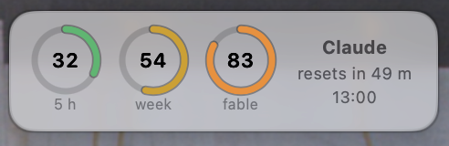
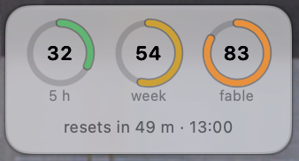
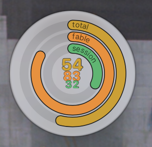
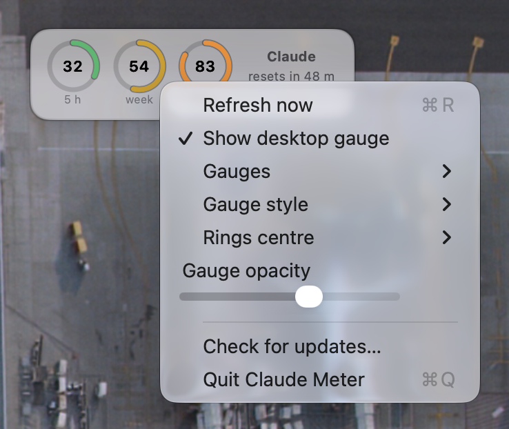

# Claude Meter

A small menu bar (macOS) / system tray (Windows) app that shows your **Claude
plan usage** at a glance. It shows the same numbers as the Claude app's
*Settings → Usage* screen, without having to go looking for them.


## Floating gauge styles

All styles are Liquid Glass on macOS 26 and later, frosted on older macOS, and their opacity is adjustable. Windows has the same three styles and an opacity slider.

<table>
  <tr>
    <td align="center"><br>One line</td>
    <td align="center"><br>Square</td>
  </tr>
  <tr>
    <td align="center"><br>Rings (outer total, then the model, then the session)</td>
    <td align="center"><br>Right-click menu with the opacity slider</td>
  </tr>
</table>

## Features

- **Menu bar / tray icon**: a ring that goes green, amber, red for the limit you choose to track (worst limit by default). On macOS the percentage sits next to the icon; on Windows it is drawn inside the ring.
- **Three ring gauges in the popover / flyout**: the 5-hour session, the weekly limit for all models, and the per-model weekly limit. Any further per-model limits show as bars.
- **Also in the popover**: reset countdowns, your plan badge and a 24-hour usage sparkline.
- **Choose which limits are shown as gauges** (Gauges in the gear or tray menu).
- **Floating desktop gauge**: an always-on-top panel you can drag anywhere; the position is remembered.
- **Three floating styles**: one line, square, or concentric rings (week outside, then the model, then the session).
- **Rings centre option**: choose whether the week or the session number is largest in the centre.
- **Opacity slider** for the floating gauge: clear glass to solid on macOS (a slider in the right-click menu, five steps in the gear menu); 20% to 100% on Windows (tray menu).
- **Usage warnings**: a notification when a limit crosses a threshold (80, 90 or 95%, or off). It warns once per approach and re-arms after the reset or a drop.
- **One-click sign-in** when Claude Code is signed out: **Sign in to Claude Code…** runs `claude auth login` for you.
- **Update check** against GitHub Releases, with a one-click update on macOS (see [Updates](#updates)).
- **Status file** for other programs to read your live usage (see [Status file](#status-file)).
- **Launch at login**, plus gear/tray menu settings for the percent display and the update check.

Works with any Claude subscription (Pro, Max, …). It displays whatever limits your plan reports. Dates and times follow your system locale.

## Requirements

Both platforms need [Claude Code](https://claude.com/claude-code) installed
and signed in at least once **on the same machine** (that's where the
credentials come from). To sign in, run `claude auth login`.

- **macOS**: macOS 14 or later (the floating gauge uses Liquid Glass on macOS 26+
  and the frosted material on 14-15); Xcode Command Line Tools to build
  (`xcode-select --install`).
- **Windows**: Windows 10 or later. To build you need the
  [.NET 8 SDK](https://dotnet.microsoft.com/download/dotnet/8.0)
  (`winget install Microsoft.DotNet.SDK.8`); to *run*, the standard build
  needs the .NET 8 Desktop Runtime, while a `-Portable` build (or a
  [Releases](https://github.com/bernmc/claude-meter/releases) exe) is fully
  self-contained and needs nothing installed.

## Install

### macOS

```sh
git clone https://github.com/bernmc/claude-meter.git
cd claude-meter/macos
./build.sh --install
```

That compiles a universal binary, ad-hoc signs it, installs to
`~/Applications/Claude Meter.app`, and launches it. No Xcode project, no
dependencies, one Swift file.

### Windows

```powershell
git clone https://github.com/bernmc/claude-meter.git
cd claude-meter\windows
.\build.ps1 -Install
```

That compiles and installs to `%LOCALAPPDATA%\Programs\Claude Meter`, then
launches it. No Visual Studio, no dependencies, one C# file. Add `-Portable`
to instead produce a self-contained exe that runs on machines without .NET
(it targets your machine's architecture; override with `-Arch x64`/`-Arch arm64`).

Prefer not to build at all? Grab the standalone exe for your architecture
from [Releases](https://github.com/bernmc/claude-meter/releases). The exes
are unsigned, so SmartScreen will warn on first run: "More info → Run anyway".

To test the data path without the UI:

```sh
# macOS
"$HOME/Applications/Claude Meter.app/Contents/MacOS/Claude Meter" --once
# Windows
& "$env:LOCALAPPDATA\Programs\Claude Meter\Claude Meter.exe" --once
```

#### Sign-in expired?

If the meter shows "Claude Code sign-in has expired or been revoked" or "Claude
Code is signed out", click **Sign in to Claude Code…** in the menu or the
popover / flyout. It runs `claude auth login`. You can also run
`claude auth login` yourself in a terminal. On Windows, if Claude Code isn't
installed, the button shows the `winget install Anthropic.ClaudeCode` command to
run first.

## Is it safe to run?

This app handles your Claude Code sign-in, so you should be able to check
what it does rather than take it on trust. The whole app is two source
files, `macos/main.swift` and `windows/Program.cs`, plus a build script
per platform. A person can read them in an afternoon, and an AI assistant
can read them in a minute.

**Every network destination in the code**

| Host | When | What is sent |
|---|---|---|
| `api.anthropic.com` (usage endpoint) | every 60 s (on macOS, every 5 s for up to 3 minutes after you click Sign in) | your Claude Code access token, as a bearer header |
| `platform.claude.com` (token endpoint) | only when the access token has expired | your refresh token, to get a new pair |
| `api.github.com` (releases/latest) | 10 s after launch, then daily, or on demand; can be turned off | nothing but the app's version in the user-agent |
| `github.com` | only when you click Update or Open release page | opens the page in your browser; on macOS with a checkout, Update runs `git pull` in Terminal. The app sends no data itself |
| `code.claude.com` | only on Windows, when Claude Code is not installed and you click Open install page | opens the page in your browser; nothing sent by the app |

There are no other hosts, no analytics, no crash reporting and no
telemetry. Your tokens are sent to Anthropic's endpoints only.

**Everything it writes**

- Your Claude Code credential store, only to save a refreshed token pair
  in the same format Claude Code uses (the macOS keychain item
  `Claude Code-credentials`; on Windows the file
  `%USERPROFILE%\.claude\.credentials.json`). On macOS it also deletes a stale
  empty-account duplicate of that same keychain item if one exists.
- Its own usage history in `~/Library/Application Support/Claude Meter/` (macOS), or
  settings and usage history in `%APPDATA%\Claude Meter\` (Windows). On macOS the
  settings are stored with `defaults`, in the domain `au.bernard.claude-meter`.
- The optional status file described below.
- On macOS, two small shell scripts it generates and opens in Terminal
  when you click Sign in or Update: one runs `claude auth login`, the
  other runs `git pull` and the build script in your checkout. You see
  them run. On Windows, Sign in runs your installed `claude auth login` in a console
  window; no script is generated.

**Local programs it runs**

macOS runs `/usr/bin/security` to read and write the keychain item, `/usr/bin/osascript` only as a notification fallback, and Terminal for the two generated scripts. Windows runs `where.exe` to find `claude`, and `claude auth login` when you click Sign in. None of these send your tokens anywhere; the sign-in and update steps contact Anthropic and GitHub, as listed above.

**What it never does**

It never reads any other keychain item or file, never installs anything
persistent beyond the optional launch-at-login entry, and never contacts a
host that is not in the table. Apart from the sign-in and update steps
listed above, which run in a window you can see, it never downloads or runs
code at runtime.

**Check it yourself**

Paste this into Claude (or another assistant that can read a public
repository) and read the verdict before you build the app:

```
I am considering running Claude Meter, an open-source menu bar app that reads my Claude Code sign-in from my keychain (macOS) or from ~/.claude/.credentials.json (Windows) to show my plan usage. Audit it for anything malicious or unsafe before I run it.

Repository: https://github.com/bernmc/claude-meter
The whole app is two source files, macos/main.swift and windows/Program.cs, plus macos/build.sh, windows/build.ps1, windows/ClaudeMeter.csproj and .github/workflows/release.yml. Read all of them in full.

Report, with file and line references:
1. Every network destination the code can contact and what is sent to each. Flag anything other than api.anthropic.com, platform.claude.com, api.github.com, or opening a github.com or code.claude.com page in the browser.
2. Everything it does with my credentials: where it reads them, what it stores, where it writes, and whether a token could leave the machine anywhere except Anthropic's own endpoints.
3. Every file it writes or executes, including any scripts it generates and runs.
4. Anything obfuscated, encoded, fetched at runtime, or that changes behaviour based on time, locale or environment.
5. Whether the build scripts and the GitHub Actions workflow do anything beyond compiling and publishing the executables.
Finish with a plain verdict: safe to run as published, or not, and why.
```

If the verdict mentions anything not covered above, open an issue; that
is either a bug in this README or in the app, and both get fixed.

## How it works

- It reads Claude Code's OAuth credentials from where Claude Code keeps them:
  the **login keychain** on macOS (service `Claude Code-credentials`, via
  `/usr/bin/security`), the file `%USERPROFILE%\.claude\.credentials.json` on
  Windows.
- Every 60 s it calls `GET https://api.anthropic.com/api/oauth/usage` (the
  endpoint the Claude app's usage screen uses) with your token.
- When the access token expires it refreshes it via
  `POST https://platform.claude.com/v1/oauth/token` (Claude Code's public
  OAuth client id) and **writes the rotated tokens back** so Claude Code stays
  signed in. This mirrors what Claude Code does itself.
- Usage history for the sparkline is stored locally with 7-day retention, in
  `~/Library/Application Support/Claude Meter/` (macOS) or
  `%APPDATA%\Claude Meter\` (Windows).

> **Note:** sign in to Claude Code separately on each machine you run
> Claude Meter on. Don't copy the credentials file between machines. Refresh
> tokens rotate on use, and two copies of the same token family will sign
> each other out.

If Claude Code gets signed out, the meter shows a red "!" and a "Sign in to
Claude Code…" button (see [Sign-in expired?](#sign-in-expired)).

## Updates

Claude Meter asks GitHub Releases
(`GET https://api.github.com/repos/bernmc/claude-meter/releases/latest`) whether
a newer version exists. No credentials are sent. It checks 10 seconds after
launch and then every 24 hours, and on demand from **Check for updates…** in
the gear menu or (macOS) the right-click menu. A repo with no releases yet
counts as up to date. The automatic check is a gear-menu toggle, **Check for
updates automatically** (on by default).

When a newer release exists you get one notification per version, and the
popover shows "Update available: vX.Y" with a button:

- **macOS**: **Update…** opens Terminal on `update.command` (written to
  `~/Library/Application Support/Claude Meter/`), which runs `git pull --ff-only`
  in your checkout and then `macos/build.sh --install`. This needs a checkout;
  without one the button reads **Open release page…** and opens the release in
  your browser. The right-click menu also gets **Update to vX.Y…**.
- **Windows**: the button opens the release page in your browser.

`defaults` keys (macOS, domain `au.bernard.claude-meter`):

| Key | Type | Default |
| --- | --- | --- |
| `autoUpdateCheck` | bool | true |
| `updateRepoPath` | string, path to the repo checkout (must contain `macos/build.sh`) | unset; on first launch it is set to `~/SynologyDrive/AI_Context/01-Projects/Claude_Toolkit/Claude_Meter/claude-meter` if that folder exists |

`--check-update` prints `current <v>, latest <tag or none>, newer: yes/no` and
exits 0 (exit 2 on a network error).

## Status file

macOS and Windows. On every refresh attempt Claude Meter atomically writes
the current snapshot to `~/SynologyDrive/AI_Context/01-Projects/
Claude_Toolkit/Claude_Meter/status/`, so other local tools can read live
usage without touching the credentials or Anthropic's endpoint. macOS writes
`current.json`. Windows writes `current-<hostname>.json` (hostname
lower-cased, e.g. `current-win-cnc.json`) so each machine has its own file
and the sync never sees two writers (the `status` folder is created if
missing). If the `Claude_Meter` project folder itself is absent, Windows
falls back to `%APPDATA%\Claude Meter\status\current-<hostname>.json`:

```json
{
  "fetched_at": "2026-09-09T05:32:10Z", "checked_at": "2026-09-09T05:32:11Z",
  "plan": "max", "error": null,
  "session": { "percent": 41.0, "resets_at": "2026-09-09T09:00:00Z" },
  "weekly_all": { "percent": 18.4, "resets_at": "2026-09-14T00:00:00Z" },
  "models": [{ "name": "Fable", "percent": 12.1, "resets_at": "…" }]
}
```

Controlled by two keys, `statusExportPath` (string, overrides the full path)
and `statusExportEnabled` (bool, default true), set with `defaults` on macOS
or in `%APPDATA%\Claude Meter\settings.json` on Windows, or with the "Status
file" toggle in the gear/tray menu. `--status` does a one-shot fetch, writes
the file, and prints the same JSON to stdout.

## Disclaimer

This is an **unofficial** tool, not affiliated with or endorsed by Anthropic.
It uses undocumented endpoints that Anthropic may change or remove at any
time, which would break the app without notice. Use at your own risk.

## Uninstall

**macOS**: quit the app, then:

```sh
rm -rf ~/Applications/"Claude Meter.app" ~/Library/Application\ Support/"Claude Meter"
defaults delete au.bernard.claude-meter
```

The two generated scripts (`sign-in.command` and `update.command`) live in the
Application Support folder, so the `rm -rf` above removes them too.

**Windows**: quit the app (tray icon → Quit), then:

```powershell
Remove-Item -Recurse -Force "$env:LOCALAPPDATA\Programs\Claude Meter", "$env:APPDATA\Claude Meter"
Remove-ItemProperty -Path HKCU:\Software\Microsoft\Windows\CurrentVersion\Run -Name "Claude Meter" -ErrorAction SilentlyContinue
```

Your Claude Code credentials are left untouched.

## License

[MIT](LICENSE)
